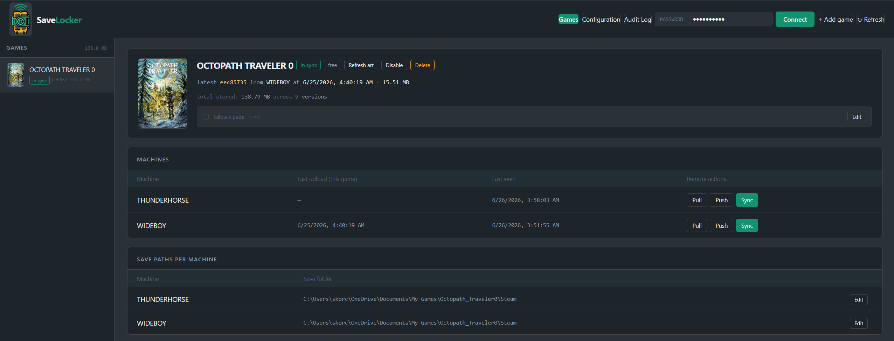
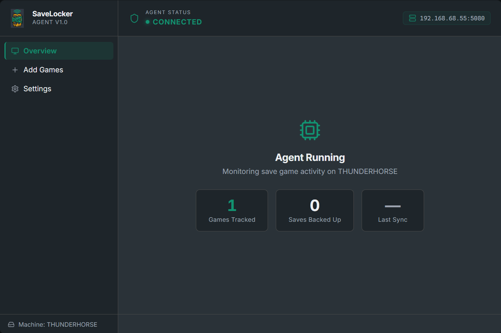
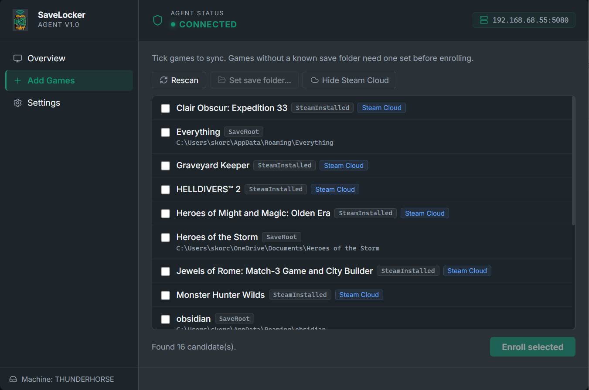
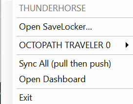
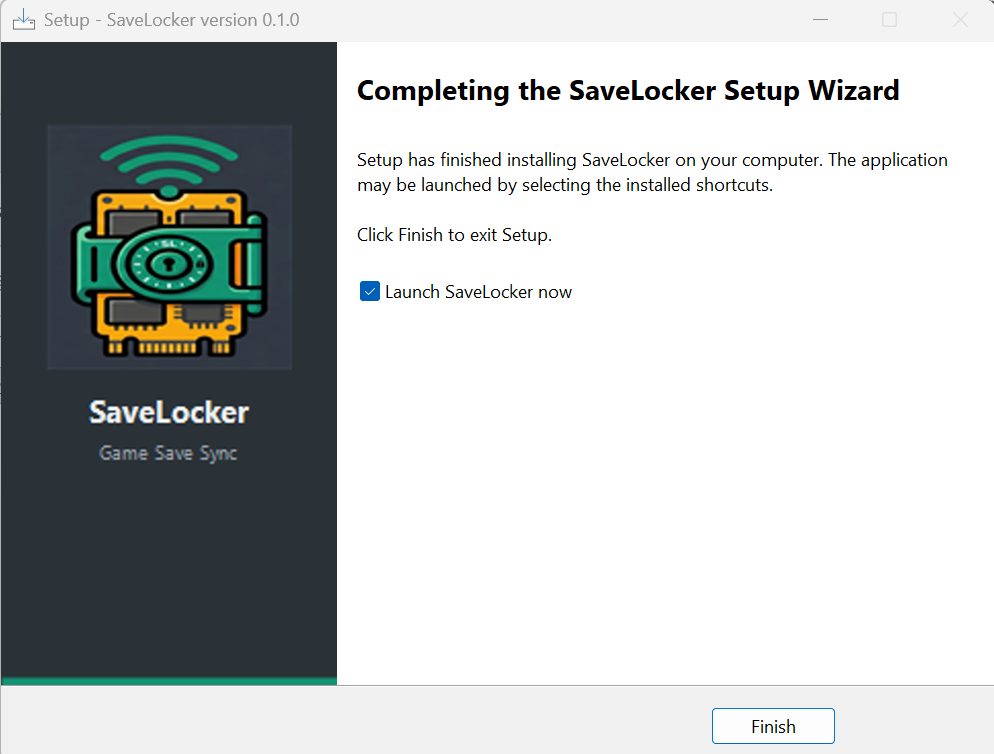

# SaveLocker

**Save-game sync for games without cloud saves.** An agent on each machine watches your save folders, pushes archives to a self-hosted server after each session, and pulls the latest save before you launch — so you can move between a **Windows PC and a Steam Deck** without copying saves by hand.


---



## Features

- **Windows and Linux / Steam Deck agents** — a WinForms tray app on Windows, and a headless Proton launch-wrapper agent for the Steam Deck. Both share the same sync engine (`Agent.Core`), so a Proton save on the Deck and a native save on Windows are the *same save* and round-trip byte-for-byte
- **One-command enrollment** — the console mints a **single-use, ~15-minute** policy file (server URL + games); the agent trades it for its own machine key, so **no API key is ever copied by hand**. On Windows this is a page in the installer; on the Deck it is `savelocker enroll --file <policy>`
- **Trust-on-first-use TLS pinning** — the agent pins the server's TLS key at enrollment and warns (never blocks) if it changes, so a routine certificate renewal can't take a headless Deck offline
- **Automatic sync** — watches save folders, waits for the game to finish writing (settle gate) after it exits, then pushes; pulls the latest save before launch
- **Lease / checkout model** — one machine holds an exclusive lease while a game is running; others are warned before they can stomp each other's progress; the lease auto-renews so long sessions never silently expire
- **Conflict detection** — content-hash comparison on every upload; diverged saves are flagged as conflicts rather than silently overwritten; resolve in the dashboard (pick a winner, roll back to any prior version)
- **Fleet health reporting** — a headless Deck can't pop a toast, so agents report problems (blocked pull, missing save folder, unreachable server…) to the console: a problem badge in the nav bar plus per-machine health — online / offline / never-reported, agent version, last sync, queued pushes
- **Agent auto-update (Windows)** — when the console hosts a newer installer the agent offers it and updates itself silently; the server can also auto-poll GitHub Releases for new versions
- **Offline retry queue** — pushes that fail while the server is unreachable are queued to disk and drained automatically when the connection returns
- **Game auto-detection** — reads the community [Ludusavi manifest](https://github.com/mtkennerly/ludusavi-manifest) to resolve save paths for thousands of games; also parses Steam library and `shortcuts.vdf` (native and Flatpak Steam, plus Proton `compatdata` prefixes on Linux)
- **Per-machine save paths** — each machine stores its own resolved path; the server suggests a canonical path that agents auto-adopt when it exists locally
- **Per-game exclude globs + upload cap** — gitignore-style patterns skip logs/caches at any depth; a size cap keeps a runaway folder from being archived
- **Web dashboard** — React SPA served by the server container; browse games, cover art, version history, per-machine activity, conflict resolution, fleet health, audit log, and configuration
- **Agent UI** — React app served locally by the agent (port 5178; an embedded WebView2 window on Windows, `http://localhost:5178` on Linux); enroll games, manage settings, view sync status
- **Per-game retention limits** — keep *N* versions per game (global default 10, overridable per game); manual version delete
- **Admin password auth** — dashboard protected by PBKDF2-SHA256 password; unprotected on first run
- **Audit log** — every push, pull, lease, conflict, enrollment, and admin action is recorded with machine + game + timestamp
- **Cover art** — fetches grid / hero / logo / icon from [SteamGridDB](https://www.steamgriddb.com/) and caches them in the server
- **Installers** — a self-contained Windows installer (Inno Setup, with in-wizard enrollment) and a self-contained Linux / Steam Deck tarball; neither needs a .NET runtime present

---

## Architecture

```
  ┌─────────────────────────────┐
  │  Windows PC (tray agent)    │
  │  ┌───────────────────────┐  │
  │  │  SaveLocker tray app  │  │
  │  │  React UI (WebView2)  │  │
  │  │  Folder watchers      │  │         ┌──────────────────────────────┐
  │  │  Process watcher      │  │◄──────► │  Server (Docker / unRAID)    │
  │  │  Offline queue        │  │  HTTP   │  ASP.NET Core  +  SQLite     │
  │  └───────────────────────┘  │         │  Archive store (zip files)   │
  └─────────────────────────────┘         │  React dashboard (wwwroot)   │
                                          │  Nightly backups + art cache │
  ┌─────────────────────────────┐         └──────────────────────────────┘
  │  Steam Deck (headless agent)│                      ▲
  │  Proton launch wrapper      │◄────────────────────►│
  │  systemd --user daemon      │        HTTP
  └─────────────────────────────┘
```

The server is the single source of truth. Agents only make outbound HTTP calls — no inbound ports required, so it works through NAT/firewalls. The agent polls for queued commands every ~20 seconds, so the dashboard can trigger remote push / pull / sync / scan and reconcile the game list.

---

## Screenshots

### Agent

| Overview | Add Games |
|---|---|
|  |  |

### System tray



### Installer



---

## Getting started

### 1 — Run the server

The server ships as a Docker image built and pushed automatically on every commit to `main`.

**Docker Compose (recommended):**

```yaml
services:
  savelocker:
    image: ghcr.io/skorcherx/savelocker:latest
    container_name: savelocker-server
    ports:
      - "5080:8080"
    volumes:
      - /mnt/user/appdata/savelocker:/data
    restart: unless-stopped
```

```sh
docker compose up -d
# Dashboard at http://<server-ip>:5080
```

**Environment variables:**

| Variable | Default | Description |
|---|---|---|
| `Storage__DbPath` | `/data/savelocker.db` | SQLite database path |
| `Storage__ArchiveRoot` | `/data/archives` | Save archive directory |
| `Storage__RetainVersionsPerGame` | `10` | Default versions kept per game |
| `SteamGridDB__ApiKey` | *(unset)* | Cover art — set here or in the dashboard |

### 2 — Create an enrollment file

In the dashboard: **Configuration → Enroll a machine**. Optionally name the machine (which *binds* the file to that name), then download the `.json` policy file and copy it to the target machine. The file carries a single-use token that expires in about 15 minutes — if it expires, just create another.

### 3 — Install and enroll the agent

**Windows** — download `SaveLocker-Agent-Setup-x.x.x.exe` from [Releases](https://github.com/SkorcherX/SaveLocker/releases) and run it. On the **Enroll this machine** page, browse to the policy file; the installer shows which server and machine name it will join, and the machine is **online in the console before the installer closes**. (SmartScreen warns because the installer isn't code-signed yet — *More info → Run anyway*.) For unattended installs: `Setup.exe /SILENT /ENROLL="C:\path\policy.json"`.

**Linux / Steam Deck** — the agent is headless; the console is its UI. In Desktop Mode:

```sh
tar -xzf savelocker-x.x.x-linux-x64.tar.gz
./SaveLocker/install.sh
savelocker enroll --file ~/Downloads/policy.json
savelocker doctor            # diagnoses the whole chain — the command to remember
```

It installs under `~/.local/share/SaveLocker` (never `/usr` — SteamOS's rootfs is wiped on update) and enables a `systemd --user` service. To sync a game, set its Steam **Launch Options** to `savelocker run -- %command%`, which pulls before launch and pushes after exit.

### 4 — Add games

In the agent window → **Add Games**: the agent scans for Steam titles and games matching the Ludusavi manifest. Check the ones you want, set save folders for any that couldn't be auto-detected, and click **Enroll**. You can also add games from the dashboard and they'll appear on each agent at the next poll.

---

## Building from source

**Requirements:** .NET 10 SDK, Node 22+, npm

```sh
git clone https://github.com/SkorcherX/SaveLocker.git
cd SaveLocker
```

### Server

```sh
cd src/Server
dotnet run
# API + dashboard at http://localhost:5179
```

The React dashboard is built separately for development:

```sh
cd web
npm install
npm run dev   # proxies /api to :5179 — open http://localhost:5173
```

### Windows agent

```sh
# Build (stop the running agent first — it locks the DLLs)
dotnet build src/Agent/SaveLocker.Agent.csproj --no-incremental

# Run (tray mode)
src/Agent/bin/Debug/net10.0-windows/SaveLocker.Agent.exe

# Run (CLI)
src/Agent/bin/Debug/net10.0-windows/SaveLocker.Agent.exe status
```

The Windows tray (`src/Agent`) and the headless Linux daemon (`src/Agent.Linux`) are thin hosts over the shared, platform-neutral sync engine in `src/Agent.Core`. The agent UI is a Vite/React app in `agent-ui/`; MSBuild runs `npm run build` and copies `dist/` into the agent output on every build.

### Linux / Steam Deck tarball

```sh
packaging/linux/build-linux.sh    # self-contained publish → savelocker-<ver>-linux-x64.tar.gz
```

> Build the tarball on the **oldest glibc you support** (CI uses `ubuntu-latest`). A self-contained .NET binary binds to the build host's glibc and runs forward-compatibly on newer systems, but never the reverse — build it on something newer than SteamOS and users get `GLIBC_2.4x not found`.

### Windows installer

Requires [Inno Setup 6](https://jrsoftware.org/isinfo.php).

```powershell
.\installer\build-installer.ps1
# Output: installer/dist/SaveLocker-Agent-Setup-<version>.exe
```

---

## CI / CD

Every push to `main` builds the dashboard, publishes the ASP.NET server, and pushes a Docker image to `ghcr.io/skorcherx/savelocker:latest`. To deploy on unRAID: `docker compose pull && docker compose up -d`.

Tagging `vX.Y.Z` builds **both** agents on a release runner and attaches them to a GitHub Release — the Windows installer (`windows-latest`) and the Linux tarball (`ubuntu-latest`).

Pull requests run the full test matrix: .NET / web / agent-UI builds, the Docker image build, the Linux agent suite (integration + enrollment + health + hardening), and a **cross-OS round-trip** that hands the server's own SQLite DB and archive store between a Windows and an Ubuntu runner to prove a save survives a Windows ↔ Linux round-trip byte-for-byte.

---

## How conflict resolution works

1. Agent on **Machine A** launches a game → acquires lease, pulls latest save
2. Agent on **Machine B** launches the same game → lease denied, agent UI pops up with a warning banner; B plays anyway (B's push on exit will land as a conflict)
3. Both machines push diverged saves → server records a **conflict**, leaves the prior head intact
4. Dashboard shows the conflict — pick which save wins, or roll back to any archived version
5. Next sync on each machine picks up the resolved head

---

## Project structure

```
SaveLocker/
├── src/
│   ├── Shared/         # Wire contracts, content hashing + zip restore, manifest loader
│   ├── Server/         # ASP.NET Core server + EF Core / SQLite (Docker)
│   ├── Agent.Core/     # Platform-neutral sync engine (push/pull, settle gate, enroll, health)
│   ├── Agent/          # Windows tray host (.NET 10, WinForms, WebView2) → Agent.Core
│   └── Agent.Linux/    # Headless Proton agent → binary `savelocker` (daemon / run / doctor)
├── web/                # React admin dashboard (Vite, TypeScript, Tailwind CSS v4)
├── agent-ui/           # React agent UI (Vite, TypeScript) — served locally by each agent
├── installer/          # Inno Setup script + wizard artwork
├── packaging/linux/    # Self-contained tarball build + install.sh + systemd unit
└── SaveLocker/         # Obsidian vault — living project notes and decisions
```

---

## Roadmap

- [x] Linux / Steam Deck agent (Proton launch wrapper, headless daemon, enrollment, health)
- [ ] Code-signing — remove the SmartScreen warning for Windows users
- [ ] Auto-update for the Linux agent (Windows already self-updates; the Deck re-runs `install.sh`)
- [ ] macOS agent
